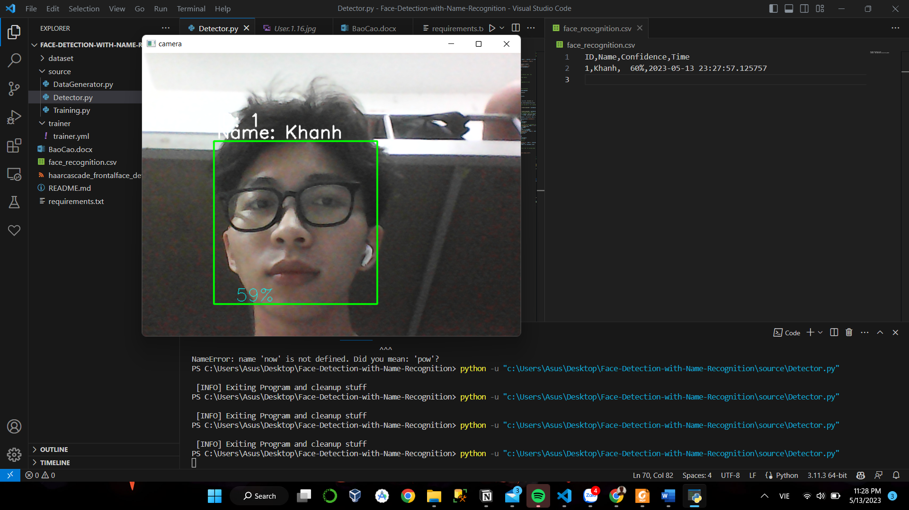

# Face_attendance
Face Detection and Attendance by OpenCV

# Usage
- Run file DataGenerator.py to create your custom dataset
- Run file Training.py to train model with your dataset
- Finally, fun file Detector.py to implement model, result will be saved to file face_recognition.csv
# Help
Please feel free to raise any issues on the GitHub repository or contact me via email: nqkdeveloper@gmail.com if you encounter any problems.
Hope you enjoy my code!
